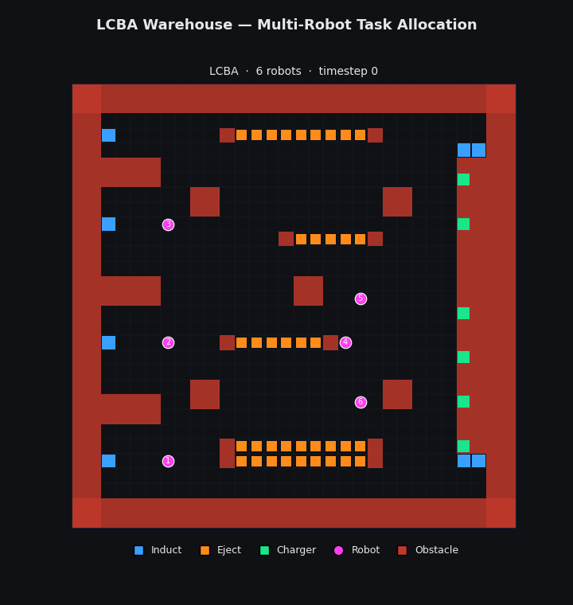

# LCBA Warehouse System

**Decentralized Multi-Robot Task Allocation for Warehouse Automation**

[](https://www.python.org/downloads/)

<p align="center">
  
</p>

<p align="center">
  <em>LCBA in action: 6 robots performing collision-free induct→eject transport on the <code>warehouse_small</code> map. Blue = induct, orange = eject, green = chargers, red = obstacles.</em>
</p>

<p align="center">
  <sub>Rendered directly from simulator output — regenerate with <code>python experiments/animate_trajectory.py</code> (see <a href="#visualization">Visualization</a>). For an interactive ROS2/RViz2 replay, see <a href="https://github.com/Shreyas0812/gridworld_rviz">gridworld_rviz</a>.</sub>
</p>

This repository implements **LCBA** (Local Consensus-based Bundle Algorithm), a decentralized multi-robot task allocation algorithm designed for real-time warehouse operations under intermittent communication. LCBA extends GCBBA (Global Consensus-based Bundle Algorithm) with local subgraph consensus, enabling correct operation on disconnected and dynamically changing communication graphs.

Developed as part of a Master's thesis at the **University of Pennsylvania, Department of Robotics (ROBO)**. The full thesis is available [here](presentation/raorane-thesis.pdf).

---

## Motivation

Existing decentralized task allocation methods (CBBA, SGA) assume a connected communication graph and exhibit super-quadratic computational scaling that becomes infeasible at realistic warehouse task loads. In real warehouses, range-limited radios, metal shelving, and robot mobility create dynamic communication topologies that may be partitioned at any moment. LCBA was designed to address both challenges simultaneously: operate correctly on arbitrary (including disconnected) communication graphs while maintaining real-time feasibility under high task arrival rates.

---

## Key Results

Across **432 simulation runs** with 6 robots, 8 induct stations, and 38 eject stations:

- **Throughput**: LCBA achieves ~0.80 tasks/timestep (near theoretical capacity) across all communication ranges. CBBA collapses to ~0.14 and SGA to ~0.28 at high load — a **6x throughput gap**.
- **Allocation latency**: Static LCBA averages ~500ms per allocation call at high load. SGA averages ~8,000ms (16x slower). CBBA hits the 10-second timeout ceiling.
- **Scaling**: Power-law fits yield scaling exponents of k ≈ 1.89–2.20 for LCBA versus k ≈ 2.98–3.41 for baselines. LCBA is the only method that remains within the 1s/timestep real-time budget.
- **Communication resilience**: LCBA throughput is flat from fully disconnected (comm_range=5) to fully connected (comm_range=45) regimes. Baselines degrade severely under sparse communication.
- **Queue management**: LCBA maintains near-zero queue depth at all loads. CBBA queues saturate at ~50% of timesteps at high load, actively discarding arriving tasks.

---

## Algorithm Overview

### LCBA (Local Consensus-based Bundle Algorithm)

LCBA is structured around three phases per allocation round:

1. **Bundle Building**: Each robot independently constructs an ordered bundle of tasks by evaluating marginal utility (Remaining Path Time metric). Tasks are inserted into the bundle at the position that maximizes path efficiency, respecting a per-agent capacity limit.

2. **Local Consensus**: Instead of requiring global consensus across the full fleet (as in CBBA/GCBBA), LCBA restricts consensus to each robot's current connected component. Robots within the same component exchange bids and resolve conflicts through timestamp-based arbitration. Robots in disconnected components proceed independently — they can begin executing immediately rather than stalling.

3. **Conflict Resolution on Reconnection**: When previously disconnected components merge, LCBA detects and resolves stale or conflicting assignments using timestamp comparisons. Formal guarantees ensure component-local conflict-freedom (Theorem 1) and post-reconnection conflict resolution (Proposition 1).

### Integration Architecture

The full simulation pipeline integrates:

- **Task Allocation** (LCBA/GCBBA, CBBA, or SGA) — assigns induct-to-eject transport tasks to robots
- **Path Planning** — priority-based Time-Expanded A* with reservation tables for collision-free multi-agent pathfinding
- **Event-Driven Replanning** — triggers reallocation on batch task completion or periodic intervals, bounding allocation staleness
- **Energy-Aware Scheduling** — agents monitor battery levels and autonomously navigate to charging stations when energy is low

---

## Repository Structure

```
LCBA_Warehouse_System/
├── gcbba/                          # Core LCBA implementation (named gcbba/ for historical reasons — LCBA evolved from an earlier GCBBA prototype)
│   ├── GCBBA_Agent.py              # Agent: bundle building, bidding, consensus, conflict resolution
│   ├── GCBBA_Orchestrator.py       # Orchestrator: manages allocation rounds across all agents
│   ├── GCBBA_Task.py               # Task model: paired induct (pickup) → eject (delivery)
│   ├── GCBBA_warehouse.py          # Warehouse-specific GCBBA configuration
│   └── tools_warehouse.py          # Utilities: communication graph construction, agent/task init
│
├── path_planning/            # Multi-agent path planning
│   ├── grid_map.py                 # YAML config → 3D occupancy grid with BFS distance precomputation
│   └── cooperative_astar.py        # Cooperative A* — time-expanded A* with reservation tables
│
├── baselines/                      # Baseline algorithms for comparison
│   ├── CBBA_Agent.py               # Standard CBBA (full-bundle + local consensus)
│   ├── CBBA_Orchestrator.py        # CBBA orchestrator
│   └── SGA_Orchestrator.py         # Sequential Greedy Algorithm (centralized upper bound)
│
├── integration/                    # Simulation orchestration
│   ├── orchestrator.py             # IntegrationOrchestrator: full simulation loop
│   │                               #   - Task injection (Poisson arrivals with queue management)
│   │                               #   - Allocation dispatch (GCBBA/CBBA/SGA)
│   │                               #   - Path planning and collision avoidance
│   │                               #   - Agent state machine (idle/moving/executing/charging)
│   │                               #   - Event detection and replanning triggers
│   └── agent_state.py              # Per-agent state machine and task execution logic
│
├── experiments/                    # Experiment runner and analysis
│   ├── run_experiments.py          # Parallel experiment runner with full metric collection
│   ├── plot_results.py             # Publication-quality plotting and statistical analysis
│   └── recover_summary.py          # Utility to reconstruct summary CSVs from run data
│
├── config/                         # Warehouse environment configurations (YAML)
│   ├── gridworld_warehouse_small.yaml   #   6 agents,  30x30  grid
│   ├── gridworld_warehouse_large.yaml   #  18 agents,  60x60  grid
│   ├── gridworld_crossdock.yaml         #  50 agents,  44x28  grid
│   ├── gridworld_kiva.yaml              # 100 agents,  36x36  grid
│   ├── gridworld_kiva_large.yaml        # 200 agents,  72x72  grid
│   └── gridworld_shelf_aisle.yaml       # 470 agents, 161x63  grid
│
├── results/                        # Experiment outputs
│   ├── experiments/                 # Per-run metrics, trajectories, configs
│   ├── plots/                       # Generated figures
│   └── data/                        # Aggregated data
│
├── tests/                          # Test suite
├── setup.py                        # Package installation
├── SETUP.md                        # Detailed setup guide for running experiments
└── Readme.md                       # This file
```

---

## Simulation Environments

Six warehouse environments of increasing scale, each defined as a YAML configuration specifying grid dimensions, obstacle layouts, station positions, agent spawn points, and energy parameters:

| Environment | Grid Size | Agents | Induct Stations | Eject Stations | Charging Stations |
|---|---|---|---|---|---|
| `warehouse_small` | 30 x 30 | 6 | 8 | 38 | 6 |
| `warehouse_large` | 60 x 60 | 18 | 12 | 80 | 12 |
| `crossdock` | 44 x 28 | 50 | 6 | 10 | 8 |
| `kiva` | 36 x 36 | 100 | 5 | 10 | 12 |
| `kiva_large` | 72 x 72 | 200 | 5 | 10 | 12 |
| `shelf_aisle` | 161 x 63 | 470 | 20 | 19 | 14 |

Each environment includes obstacle regions (perimeter walls, structural columns, maintenance bays), induct stations (pickup points where tasks originate), eject stations (delivery destinations), and charging stations for energy-constrained operation.

---

## Getting Started

### Prerequisites

- Python 3.10+
- git

### Installation

```bash
git clone https://github.com/shreyas0812/LCBA_Warehouse_System.git
cd LCBA_Warehouse_System

python3 -m venv .venv
source .venv/bin/activate   # Linux/macOS
# .venv\Scripts\activate    # Windows

pip install -e .
pip install scipy pandas tqdm psutil
```

### Verify Installation

```bash
python -c "from integration.orchestrator import IntegrationOrchestrator; print('OK')"
```

### Quick Smoke Test

```bash
cd experiments
python run_experiments.py --mode quick --workers 1
```

### CLI Reference

```
python run_experiments.py [options]

  --mode {quick,full}        quick: ~8 runs (verify pipeline)
                             full:  ~1296 runs (thesis data)
                             Default: full

  --config {all,ss_only,batch_only,cbba_only,sga_only,
            dmchba_only,baseline_only}
                             Which experiment types to include
                             Default: all

  --map NAME                 Map name (matches config/<NAME>.yaml)
                             Default: gridworld_warehouse_small

  --workers N                Parallel workers (1 = sequential)
                             Default: 0 (all CPU cores)

  --output PATH              Override default output directory
                             Default: results/experiments/<map>/<timestamp>

  --path-planner {ca_star,rhcr}
                             Path planning algorithm
                             Default: ca_star

  --rhcr-replanning-period H
                             RHCR replanning horizon h (only used with --path-planner rhcr)
                             Default: window_size (20)
```

### Running Full Experiments

```bash
# Smoke test — verify pipeline works (~8 runs, ~5 min)
python run_experiments.py --mode quick --workers 1

# Full thesis run, sequential (safe on all platforms, ~150 hrs)
python run_experiments.py --mode full --workers 1

# Full thesis run, 4 parallel workers (~37 hrs)
python run_experiments.py --mode full --workers 4

# Steady-state sweep only (skip batch experiments)
python run_experiments.py --mode full --config ss_only --workers 4

# Batch experiments only
python run_experiments.py --mode full --config batch_only --workers 4

# CBBA + SGA + DMCHBA baselines only (no gcbba)
python run_experiments.py --mode full --config baseline_only --workers 4

# Custom output directory
python run_experiments.py --mode full --output results/my_run --workers 4
```

> **Windows note**: Avoid `--workers 0`. Use an explicit N (e.g. `--workers 4`) or `--workers 1` for sequential. Python uses spawn-based multiprocessing on Windows; `--workers 0` uses all cores but can produce duplicated output headers.

See [SETUP.md](SETUP.md) for detailed instructions on parallelism tuning, large-map baseline strategies, and results interpretation.

---

## Visualization

The headline animation is generated directly from simulator output — no ROS required. Generate a clean demo trajectory with `python experiments/run_demo.py`, then render any run's `trajectories.csv` plus its map config to MP4/GIF:

```bash
python experiments/animate_trajectory.py \
  --config config/gridworld_warehouse_small.yaml \
  --traj   results/demo_warehouse_small/trajectories.csv \
  --out    media/lcba_warehouse_small \
  --fps 15 --format both
```

Useful flags: `--step N` (use every Nth timestep), `--start/--end` (window a time range), `--fps` (playback speed), `--trail` (motion-trail length). Station colors mirror the RViz config so stills/clips match the ROS visualizer. See **[VISUALS.md](VISUALS.md)** for the full workflow, parameter rationale, and the exact commands used to produce the committed assets.

For an interactive, drivable replay (and live grid rendering), the companion **[gridworld_rviz](https://github.com/Shreyas0812/gridworld_rviz)** workspace replays the same `trajectories.csv` in RViz2 via its `trajectory_executor` node.

---

## Experiment Sweep Parameters

The experiment runner sweeps across the following independent variables:

- **Task arrival rate**: Poisson arrival rate per induct station per timestep (e.g., 0.02–0.10)
- **Communication range**: Euclidean distance threshold for agent-to-agent communication (e.g., 3–45 grid cells)
- **Allocation method**: `gcbba` (LCBA with local consensus), `cbba` (standard CBBA), `sga` (centralized sequential greedy), `dmchba`
- **Replanning mode**: Event-driven (triggered by task completions, idle agents, or charging events)
- **Random seeds**: 3 seeds per configuration (42, 123, 456) for statistical significance

---

## Metrics Collected

Each simulation run records a comprehensive set of metrics:

**Throughput & Task Completion**: tasks completed, throughput (tasks/timestep), makespan, task wait times, queue depth, queue saturation fraction.

**Allocation Performance**: number of allocation calls, mean/max/std allocation time (ms), allocation timeout count, tasks per allocation call, trigger breakdown (batch completion vs. interval timer).

**Safety**: vertex collisions, edge collisions, deadlock events (transition-based counting — an agent stuck for 20 timesteps counts as 1 event, not 20).

**Agent Utilization**: idle ratio (mean/max/std), per-agent task completion counts, task balance std, total distance traveled.

**Energy**: charging events, charging time fraction, min energy ever reached, tasks aborted for charging.

**Path Planning**: replanning events, path planning time (mean/max).

**Wall-Clock**: total wall time, per-timestep step time (mean/max/std).

**Communication Topology**: initial graph components and diameter at t=0.

---

## Technical Details

### Task Model

Each task is a **paired pickup-delivery** operation: pick up an item at an induct station and deliver it to an eject station. The scoring function (Remaining Path Time) accounts for the full traversal path — agent position → induct → eject — using BFS distances precomputed on the obstacle-aware grid.

### Communication Graph

The communication graph is constructed dynamically based on Euclidean distance between agents. An edge exists between two agents if and only if their distance is within the configured `comm_range`. This graph may be disconnected, and its topology changes as agents move. LCBA handles arbitrary graph topologies, including fully disconnected configurations where each agent operates as its own component.

### Collision Avoidance

Multi-agent pathfinding uses a **priority-based Time-Expanded A\*** algorithm with a shared reservation table. Each agent plans a path through the (x, y, z, t) space, reserving cells at specific timesteps. Subsequent agents plan around existing reservations, avoiding both vertex conflicts (two agents at the same cell at the same time) and edge conflicts (two agents swapping cells).

### Energy Management

Agents have finite battery capacity and consume one energy unit per grid step. When an agent's remaining energy drops below a configurable threshold (multiplier × distance to nearest charger), it autonomously navigates to a charging station. Tasks in progress may be aborted if energy is critically low. Charging stations are modeled as dedicated grid cells with configurable charge duration and rate.

---

## Results Output Structure

```
results/experiments/<map_name>/<timestamp>/
    experiment_config.json       # Run parameters + machine info
    summary.csv                  # One row per run (all scalar metrics)
    summary_with_optimality.csv  # Extended summary with optimality analysis
    <run_id>/
        metrics.json             # Full per-run metrics including time-series data
        trajectories.csv         # Per-agent position traces over time
```

---

## Scalability

LCBA has been tested up to **470 agents** on the `shelf_aisle` environment (161 x 63 grid, 10,143 cells). At this scale, CBBA and SGA are computationally intractable — they consistently exceed the per-call allocation timeout of 10s, preventing meaningful simulation progress. This demonstrates a qualitative scaling advantage: LCBA scales with stable throughput to fleet sizes where baselines cannot produce any allocation at all.

| Map | Agents | LCBA | CBBA / SGA |
|---|---|---|---|
| warehouse_small | 6 | Full sweep | Full sweep |
| warehouse_large | 18 | Full sweep | Full sweep |
| crossdock | 50 | Full sweep | Worth trying |
| kiva | 100 | Full sweep | Intractable (timeout evidence) |
| kiva_large | 200 | Full sweep | Intractable |
| shelf_aisle | 470 | Full sweep | Intractable |

---

## Experimental Hardware

All experiments reported in the thesis were executed on an **AMD Ryzen 7 8840HS** (8 cores, 3.3 GHz base / 5.1 GHz boost) with **12 GB LPDDR5X RAM** running **Windows 11**.

The simulation runs as a single-threaded Python process (CPython, subject to the GIL). Reported wall-clock times are hardware-dependent and should be interpreted as **relative comparisons across methods** rather than absolute benchmarks. Simulation-time metrics — throughput, task wait time, queue depth, collision and deadlock counts — are hardware-independent and constitute the primary experimental results.

---

## Dependencies

| Package | Purpose |
|---|---|
| numpy | Simulation numerics, linear algebra |
| pyyaml | YAML configuration parsing |
| matplotlib | Visualization and plot generation |
| networkx | Communication graph construction and analysis |
| scipy | Statistical analysis (power-law fits, confidence intervals) |
| pandas | Results aggregation and CSV processing |
| tqdm | Progress bars for long-running experiments |
| psutil | Machine info logging in experiment configs |

---

## Contact

**Shreyas Raorane** — [raorane@seas.upenn.edu](mailto:raorane@seas.upenn.edu)
University of Pennsylvania, School of Engineering and Applied Science
